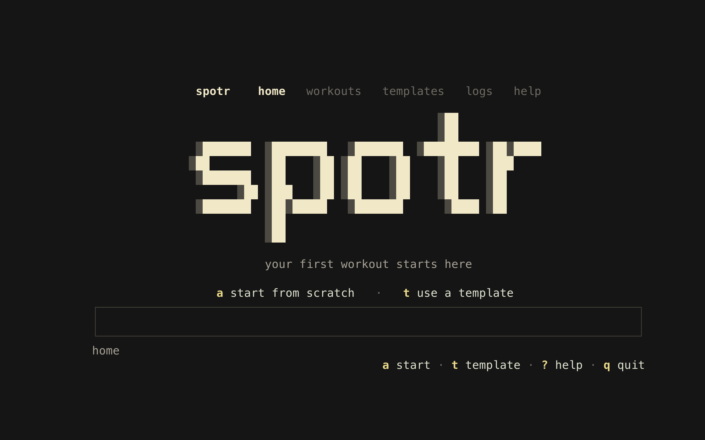

# spotr

Workout logging for nerds on the terminal.

[Website](https://spotr.info) · [Releases](https://github.com/Yokanater/spotr/releases/latest) · [Report a bug](https://github.com/Yokanater/spotr/issues/new?template=bug.yml)



spotr is a keyboard-first, local workout tracker. Build programs, run workouts,
log sets, and review your training history without an account or an internet
connection. Your data stays in a SQLite database on your computer.

## Install

### Homebrew

```bash
brew tap Yokanater/tap
brew install --cask spotr
```

### Go

```bash
go install github.com/Yokanater/spotr@latest
```

### Prebuilt binaries

Download the archive for your system from the [latest GitHub release](https://github.com/Yokanater/spotr/releases/latest):

- macOS: Apple Silicon and Intel
- Linux: x86-64 and ARM64
- Windows: x86-64 and ARM64

Extract the archive and place `spotr` (or `spotr.exe`) somewhere on your
`PATH`. Release checksums are published alongside every build.

## Use

Run:

```bash
spotr
```

Press `?` at any time to open the complete in-app help. The core controls are:

- `j` / `k` or arrow keys: move
- `enter`: open the selected item
- `a`: add
- `s`: start a workout
- `l`: log an exercise
- `v`: view logs
- `f`: finish a workout
- `e`: edit
- `d`: delete with confirmation
- `t`: browse templates
- `b` / `esc`: back
- `:`: command mode
- `q`: quit with confirmation

## Data and backups

spotr stores `spotr.db` in your operating system's user data directory:

- macOS: `~/Library/Application Support/spotr/spotr.db`
- Linux: `$XDG_DATA_HOME/spotr/spotr.db`, or `~/.local/share/spotr/spotr.db`
- Windows: `%LOCALAPPDATA%\spotr\spotr.db`

Set `SPOTR_DATA_DIR` or launch with `spotr --data-dir <directory>` to choose a
different location. To back up your data, quit spotr and copy `spotr.db`.

Versions before v0.2 stored `spotr.db` in the directory from which spotr was
launched. To migrate, quit spotr and copy that file to the location above, or
keep using its directory with `--data-dir`.

## Templates

Bundled JSON program templates live in [`templates/programs`](templates/programs).
Press `t` to browse and import them. Set `SPOTR_TEMPLATE_DIR` to use a custom
template directory.

Community templates are welcome. See [`templates/README.md`](templates/README.md)
and [`templates/schema/program-template.schema.json`](templates/schema/program-template.schema.json),
then open a pull request with your template under `templates/programs/`.

## Development

Requires Go 1.26 or newer.

```bash
git clone https://github.com/Yokanater/spotr.git
cd spotr
go test ./...
go run . --data-dir "$(mktemp -d)"
```

See [CONTRIBUTING.md](CONTRIBUTING.md) before opening a pull request. Security
issues should be reported as described in [SECURITY.md](SECURITY.md).

## License

[MIT](LICENSE)
